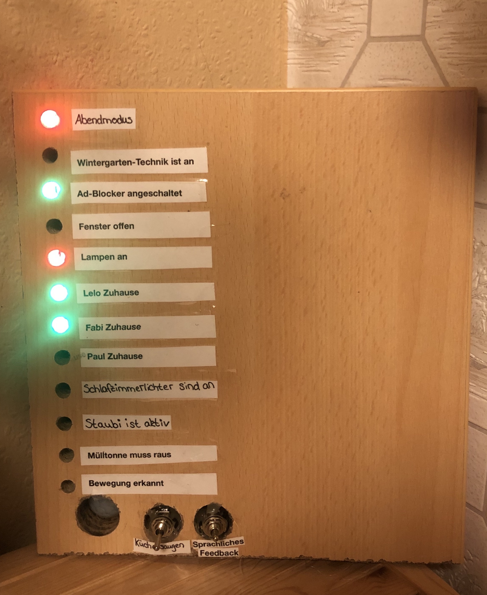

# My Home Assistant Configuration

I'm Fabian, a computer science student from Germany. I live in a shared apartment with my girlfriend and my best friend. I'm using Home Assistant for about four years right now and Home Automation has become one of my biggest hobbies. During my journey I learned a lot about keeping the network tidy, getting an own point of view of logical shortcuts between devices and a good effort-benefit- and price-performance- assessment.

Because I'm a student and home automation is a slightly expensive hobby. I started my journey in 2016 with almost only DIY sensors and actors, which are mainly driven by a ESP32/8266. Until now, much has changed. With more network devices, more complexity is added. More devices need a better Wifi-Router or an alternative network technology is needed. After a while, I switched almost every sensor to a Zigbee device. And so on...

This is my current, active configuration for everyday use. Feel free to inspire yourself and to give feedback on my setup. I look forward to discussing with you :)

**TL;DR: I received many inspirations and help from all those smart home developers and enthusiasts and I want to give something back. So here is my Home Assistant Configuration.** 

### Philosophy ###

In this chapter I want to give you a short briefing what my smart home should do and where I set my preferences.

1. The Home should work for you. It should look forward, what you want to do and helps you with that action without any further ado.

2. I love building, solder and flashing devices on my own. But during the last years I learned how true the saying “time is money” is. For a wide range of devices DIY is not as reliable and require much more maintanance then official devices. That's why I have two reasons why I build something on my own.

   - It is much cheaper than official hardware
   - It has much more functionalities than official hardware

   *To be fair: the reliability of devices increases significantly if I use community driven projects like [ESPHome](#ESPHome) or [WLED](#WLED).*

3. The more the Smart Home grows the more it needs maintenance. Thats why I try to minimize the range of different devices or networks. 

4. The avoidence of cloud services. I know if you're afraid of your data being  abused, don't collect them.

## Hardware ##

My Home Assistant instance is running in a [Docker environment](https://docs.docker.com/get-docker/) on an [Intel® NUC-Kit NUC8i3BEH](https://www.amazon.de/Intel-NUC8i3BEH-Mainboard-Generation-Processors/dp/B07JB2M5JS) with an Intel® Core™ i3-8109U and 16GB DDR4 RAM. All Smart Home related service are running on it in their own Docker container. 

### Network ###

As too many Wi-Fi devices are not good for the stability of the network and always need a power source, I needed to add another communication technology to my network. Because Zigbee is overall cheaper than Z-Wave, my decision was made quickly.

#### Zigbee #### 

All my battery equipped devices use Zigbee for communication. With the help of [Zigbee2MQTT](https://www.zigbee2mqtt.io) all received information is converted into MQTT messages. For a long time I used the [CC2531](https://www.amazon.de/CC2531-USB-Stick-zigbee2mqtt-ioBroker-Firmware/dp/B07T3GM28F) as Coordinator. All related firmware files can be found [here](https://github.com/Koenkk/Z-Stack-firmware). But because of his weak transmission strength and the low amount of direct children at the same time, I recently decided to move on to the [CC26X2R1](https://www.mouser.de/ProductDetail/Texas-Instruments/LAUNCHXL-CC26X2R1?qs=pfd5qewlna7NQQI%252B7L2KoA%3D%3D).

So far I'm very happy with it. Today I'm using 19 Zigbee sensors, which are noted down below:

| Model                                                        | Image                                                        | Quantity | Notes                                                        |
| ------------------------------------------------------------ | ------------------------------------------------------------ | -------- | ------------------------------------------------------------ |
| Aqara human body movement and illuminance sensor ([RTCGQ11LM](https://www.amazon.de/Aqara-RTCGQ11LM-Motion-Sensor-Bewegungsmelder/dp/B07D1CRRVF)) |  | 2        | Used to detect indoor motion on the stairway and the vestibule. |
| Aqara door & window contact sensor ([MCCGQ11LM](https://www.amazon.de/Aqara-MCCGQ11LM-Window-Sensor-Fensterssensor/dp/B07D37VDM3/ref=sr_1_1?__mk_de_DE=ÅMÅŽÕÑ&dchild=1&keywords=MCCGQ11LM&qid=1605394484&s=diy&sr=1-1)) |  | 6        | Used to detect entering the apartment and tracking the opened windows. |
| MiJia temperature & humidity sensor ([WSDCGQ01LM](https://www.amazon.de/Temperature-Sensor，Eamplest-Temperatur-Feuchtigkeits-Feuchtigkeitserkennung/dp/B086MZQD5C/ref=sr_1_1?__mk_de_DE=ÅMÅŽÕÑ&dchild=1&keywords=WSDCGQ01LM&qid=1605394622&s=diy&sr=1-1)) |  | 3        | Used to track the temperature and humidity of the apartment. |
| Aqara double key wireless wall switch ([WXKG02LM](https://de.aliexpress.com/item/32877238808.html?spm=a2g0o.productlist.0.0.2dc2610ao1Eubk&algo_pvid=5b3e3fd7-8bba-4599-a858-d2bba7fc7b57&algo_expid=5b3e3fd7-8bba-4599-a858-d2bba7fc7b57-2&btsid=0b0a182b16053946613325014e01f2&ws_ab_test=searchweb0_0,searchweb201602_,searchweb201603_)) |  | 3        | The perfect control center for every room. Can detect nine different “pressing”-events. |
| SYMFONISK sound controller ([E1744](https://www.amazon.de/IKEA-Symfonisk-Sound-Fernbedienung-schwarz-104-338-47/dp/B082W1GV75/ref=sr_1_1?__mk_de_DE=ÅMÅŽÕÑ&crid=1R02CA212PKGU&dchild=1&keywords=ikea+symfonisk&qid=1605394706&sprefix=ikea+sym%2Caps%2C174&sr=8-1)) |  | 1        | Currently not in use.                                        |
| Aqara wireless switch ([WXKG11LM](https://www.amazon.de/Aqara-Wireless-Switch-Mini-Lichtschalter/dp/B07D19YXND/ref=sr_1_1?__mk_de_DE=ÅMÅŽÕÑ&dchild=1&keywords=WXKG11LM&qid=1605394752&sr=8-1)) |  | 3        | Simple switch with two action. But his pressure point is not perfect in my opinion. |
| Hue motion outdoor sensor ([9290019758](https://www.amazon.de/Philips-Hue-Bewegungssensor-Aussenbereich-Tageslichtsensor/dp/B07KMP8P1Q/ref=sr_1_2?__mk_de_DE=ÅMÅŽÕÑ&dchild=1&keywords=hue+outdoor&qid=1605394774&sr=8-2)) |  | 1        | Used for capturing the outdoor temperature and entrance lighting. But expensive and a bit “rebellious” with its connection. |

Overall I'm very happy with my Zigbee setup. For the future I possibly will replace the “Aqara wireless switch” with a different model. I also should place an old [CC2531](https://www.amazon.de/CC2531-USB-Stick-zigbee2mqtt-ioBroker-Firmware/dp/B07T3GM28F/ref=sr_1_9?__mk_de_DE=ÅMÅŽÕÑ&dchild=1&keywords=CC2531&qid=1605394793&sr=8-9) with the router software for a more stable network structure.

### Wi-Fi ###

Today a Wi-Fi-network are inevitable. As our apartment is quite large, I need multiple routers to achieve a stable connection. With some old routers a configured a “Mesh”-like network with multiple [DD-WRT](https://dd-wrt.com) custom flashed routers. And overall it was a real pain to maintain and administrate. At the end of 2018 I decided to invest into two [“Google Wi-Fi”](https://www.amazon.de/Google-Wifi-Router-Duo-Pack/dp/B073D5P4L7/ref=sr_1_3?__mk_de_DE=ÅMÅŽÕÑ&dchild=1&keywords=google+wifi&qid=1605394841&sr=8-3) Routers.

These are performing inconspicuous. Everything is stable, but from a networking perspective some more settings with the app are desirable. 

But nonetheless these pucks are able to handle 45 devices with no problems. In the following table I will show you the different devices that are used. As there are quiet much, I will split that section into categories.

#### Lighting ####

I love colorful LEDs. They help to give every room some dynamic and variety. That's why I'm mainly using color-ranged bulbs and strips instead of white-ranged ones.

For bulbs and ceiling lamps um using [Yeelight](https://www.yeelight.com) Lamps. They are relatively cheap, have a LAN-Functionality and a stable Home Assistant integration.

| Model                                                        | Image                                                        | Quantity | Notes                                                        |
| ------------------------------------------------------------ | ------------------------------------------------------------ | :------: | ------------------------------------------------------------ |
| Xiaomi Yeelight Bulb V1 ([YLDP02YL](https://www.amazon.de/YEELIGHT-Smart-LED-Glühbirne-Lumen/dp/B073QPD1KX/ref=sr_1_2?__mk_de_DE=ÅMÅŽÕÑ&dchild=1&keywords=YLDP02YL&qid=1605394900&sr=8-2)) |  |    2     | Used as bedside lamps. They are less bright than the V2 and my oldest smart bulbs. |
| Xiaomi Yeelight Bulb V2 (YLDP06YL)                           |  |    3     | Used inside the Living Room as Main Lighting. One of them is located in our Storage Room. |
| Xiaomi Yeelight Bulb 1S ([YLDP13YL](https://www.amazon.de/Glühbirne-Millionen-Weißlicht-Kompatibel-Assistant/dp/B0832XR68B/ref=sr_1_1?__mk_de_DE=ÅMÅŽÕÑ&dchild=1&keywords=YLDP13YL&qid=1605395096&sr=8-1)) |  |    2     | Used in the vestibule and one outside by the entrance. I'm curious if she does survive the cold days... |
| [Yeelight Meteorite](https://www.amazon.de/Yeelight-2700K-6000K-Farbtemperatur-LED-Leuchter-LED-Kronleuchter/dp/B07MY2MTZY/ref=sr_1_1_sspa?__mk_de_DE=ÅMÅŽÕÑ&dchild=1&keywords=yeelight+Meteorite&qid=1605395144&sr=8-1-spons&psc=1&spLa=ZW5jcnlwdGVkUXVhbGlmaWVyPUEzS0paWkJJMVZIVkRRJmVuY3J5cHRlZElkPUEwOTA2NTExUUQ5RkhCQlkzS0c2JmVuY3J5cHRlZEFkSWQ9QTA3NDAyNzk5NTlXTE1FTVo4R0Qmd2lkZ2V0TmFtZT1zcF9hdGYmYWN0aW9uPWNsaWNrUmVkaXJlY3QmZG9Ob3RMb2dDbGljaz10cnVl) |  |    1     | Used in the Workspace room for dinner and ambient lighting.  |
| Xiaomi Ceiling Lamp                                          |  |    1     | Used in our kitchen. Very bright but not that cheap.         |

The lighting strips offered by Yeelight are very expensive and not worth the money when you can do it yourself :)

Im using four DIY LED Strips with the Software WLED. These are executed on an [ESP-01](https://de.aliexpress.com/item/4000505567851.html?spm=a2g0o.productlist.0.0.40194a59h8sLr7&algo_pvid=36b19a66-effe-4b3f-843c-86309eabe285&algo_expid=36b19a66-effe-4b3f-843c-86309eabe285-3&btsid=0b0a187b16053906987342338e15b5&ws_ab_test=searchweb0_0,searchweb201602_,searchweb201603_) with [RGB-Adapter](https://de.aliexpress.com/item/4000505567851.html?spm=a2g0o.productlist.0.0.40194a59h8sLr7&algo_pvid=36b19a66-effe-4b3f-843c-86309eabe285&algo_expid=36b19a66-effe-4b3f-843c-86309eabe285-3&btsid=0b0a187b16053906987342338e15b5&ws_ab_test=searchweb0_0,searchweb201602_,searchweb201603_). As [power supply](https://de.aliexpress.com/item/4000741932348.html?spm=a2g0o.productlist.0.0.1fa24d62bzqAcz&algo_pvid=c91f7f6f-7261-4fe9-9880-d96bf9194acc&algo_expid=c91f7f6f-7261-4fe9-9880-d96bf9194acc-0&btsid=2100bde316053910324372519ef81f&ws_ab_test=searchweb0_0,searchweb201602_,searchweb201603_) im using basic 5V ones and for the lighting [WS2812B LED Strips](https://de.aliexpress.com/item/32682015405.html?spm=a2g0o.productlist.0.0.322a4c9e8dQBrC&algo_pvid=d1e877f2-bc62-4237-9084-3cfd792d8485&algo_expid=d1e877f2-bc62-4237-9084-3cfd792d8485-7&btsid=2100bdd516053912230116342eaf4d&ws_ab_test=searchweb0_0,searchweb201602_,searchweb201603_). For an 3M Led Strip (60 LEDs per Meter) I'm paying around 30 Euro. On top we have all features of the [WLED](#WLED) firmware.

### Presence Detection ###

Detect residents in a specific area is not easy to establish, but is paying off. You can turn the lights off or disable the heater, when nobody is at home. You can automatically start the alarm-management or trigger the vacuum robot... There are **two level of region precision** (room based vs. home based) and **two level of human/identity precision** (there is a living thing vs. there is resident with the name).

- For the room based region precision I'm using simple motion sensors, which only detect *there is a living thing* 
- For the home based region precision um using “monitor” a simple script which runs on two Raspberry Pi Zeros. They are able to detect “known” BLE devices and as long every resident has a smartphone which does he take with him when he leaves the house, you can easily detect if a resident is at home. As long, he does not forget his phone :)

#### Problems with Presence Detection ####

|                | **There is a living thing**                                  | **There is resident with the name**                          |
| -------------- | ------------------------------------------------------------ | ------------------------------------------------------------ |
| **room based** | **Easy** Motion Sensors, Switches, Buttons (Basically every sensor that needs an interaction). | **Hard** Requires the resident to ALWAYS take their home it them. In my opinion only realizable with Smart Watches. |
| **home based** | **Easy** Motion Sensors, Switches, Buttons (Basically every sensor that needs an interaction). | **Medium** Requires BLE monitoring and well-defined scanning algorithms. Not easy to establish but very reliable. |

### Vacuum Robot ###

The newest member in our small Smart Home is a used Roborock S50 (or S51/S55 - different color). 

Why especially this device? Because it uses a smart Laser-based navigation(no random algorithms), is rootable and is supported by Valetudo. It is importent to me to interrupt the cloud connection to Xiaomi. His little brother the [Xiaomi Mi Robot](https://www.amazon.de/Xiaomi-Saugroboter-Staubsauger-Kehrmaschine-Steuerung/dp/B01LYV1EMA/ref=pd_lpo_79_t_0/260-7052561-1317654?_encoding=UTF8&pd_rd_i=B01LYV1EMA&pd_rd_r=68c901e4-bbb9-4551-96b6-79d031291d4d&pd_rd_w=Fnimb&pd_rd_wg=YIxMw&pf_rd_p=d5c9797d-0238-4119-b220-af4cc3420918&pf_rd_r=EA2CRW8TBWB03PGYNE88&psc=1&refRID=EA2CRW8TBWB03PGYNE88) has a fewer feature tree. The Roborock S50 supports virtual No-Go Borders and saves the created map over multiple cleaning runs. For a advanced comparision click [here](https://valetudo.cloud/pages/knowledge_base/supported-roborock-devices.html#gen-2).

*Note: If you want to buy this device, be sure to get one with old production date (before 2019-11) as the factory firmware (to which the robot can be reset) does support the installation of a custom ROM.*

### IR-Sender ###

As my TVs Ethernet port is not working at the moment and the Wake-On-Wi-Fi functionality does not work reliable, I needed an alternative to send commands to the TV. For this propose I'm using the [RM4C mini](https://www.amazon.de/Universal-IR-Fernbedienung-Stimmenkontrolle-Koordinierung-Intelligente-Automatisierungsmodule-Schwarz/dp/B08215598C/ref=sr_1_3?__mk_de_DE=ÅMÅŽÕÑ&dchild=1&keywords=RM4C+mini&qid=1605704505&sr=8-3). To control this handy device I use the [Broadlink Integration](https://www.home-assistant.io/integrations/broadlink/). This does also support the learing of new IR-Commands.

### ESP32/ESP8266 ###

This ESP Family is a famous name in the DIY Smart Home and IoT world. The [ESP32](https://www.amazon.de/AZDelivery-ESP32-NodeMCU-gratis-eBook/dp/B07Z83MF5W/ref=asc_df_B07Z83MF5W/?tag=googshopde-21&linkCode=df0&hvadid=427788576373&hvpos=&hvnetw=g&hvrand=8639050305478239369&hvpone=&hvptwo=&hvqmt=&hvdev=c&hvdvcmdl=&hvlocint=&hvlocphy=1003859&hvtargid=pla-898234157885&psc=1&th=1&psc=1&tag=&ref=&adgrpid=99889209552&hvpone=&hvptwo=&hvadid=427788576373&hvpos=&hvnetw=g&hvrand=8639050305478239369&hvqmt=&hvdev=c&hvdvcmdl=&hvlocint=&hvlocphy=1003859&hvtargid=pla-898234157885) is the successor of the ESP8266. Both have a lot of GPIO Pins, 5V Micro-USB power supply and Bluetooth+Wi-Fi connectivity. They also have a very large community with projects like [ESPHome](https://esphome.io) and the mentioned [WLED](https://github.com/Aircoookie/WLED).

ESPHome allows to build a firmware based on the connected sensors and devices. Ir has a big bandwidth of supported devices and sensors, which are very easy to configure. All of the following devices are base on ESPHome. Everyone who works with a lot of self programmed ESP Devices should try this service.

#### MAX7219 - Led Matrix ####

I like the idea of sharing the collected information of the apartment with the residents. At the same time there should be the possibility to notify the residents, beside sending them a notification. At this point I was searching for an alternative and found the [MAX7219 LED Matrix](https://www.amazon.de/AZDelivery-MAX7219-Matrix-Anzeigemodul-Arduino/dp/B079HVW652/ref=asc_df_B079HVW652/?tag=googshopde-21&linkCode=df0&hvadid=309901650373&hvpos=&hvnetw=g&hvrand=9116350884031864081&hvpone=&hvptwo=&hvqmt=&hvdev=c&hvdvcmdl=&hvlocint=&hvlocphy=1003859&hvtargid=pla-602010100762&psc=1&th=1&psc=1&tag=&ref=&adgrpid=62387684635&hvpone=&hvptwo=&hvadid=309901650373&hvpos=&hvnetw=g&hvrand=9116350884031864081&hvqmt=&hvdev=c&hvdvcmdl=&hvlocint=&hvlocphy=1003859&hvtargid=pla-602010100762).

On the left side you can see the current time and on the right a random information. There is also a mode for blocking information(that need an interaction to disappear) or an notification, that shows one time for about ten seconds.

#### DHT11 - Temperature/Humidity Sensor ####

In the bedroom there is still a DHT11 Sensor in use. It should be replaced with an Aqara sensor in the future to keep consistency. I'm still playing with the thought to add some other sensors to this ESP to get a  overview over the air quality...

#### HC-SR501 - PIR Sensor ####

These boards are relatively cheap but I have always bad luck with them. By now there are two of them in use and both are working on 5V (You can also power them with 3.3V). An advantage over the Zigbee counterpart is that you can adjust the delay between scans.

#### Debugpanel ####

This little board looks very ugly but saves me a lot of debugging work. All of these LEDs can be addressed individuelly, and are part of their own automation. For example: A lot of automations are based on the evening_mode, so it got its own LED.

Beside the LEDs there are also two switches and a PIR-Sensor. I thought about adding a Raspberry Pi with a Display to it, which shows a custom Home Assistant Log...

#### HX711 - Weight Sensor ####

Some of you might ask what you can do with a weight sensor in a Smart Home. A whole lot of! I use them placed under my bed to detect the presence there. Because my girlfriend weighs less than me, we can differentiate who and how much people are there. This enables a lot of handy automations.

*The idea for this use case of the HX711 is from [here](https://selfhostedhome.com/diy-bed-presence-detection-home-assistant/)*

## Software Components ##

## Future Plans ##

- Add Wii "Power" to IR Sensor
- Reintegrate my [OpenTherm Gateway](https://www.nodo-shop.nl/nl/opentherm-gateway/188-opentherm-gateway.html). Looking forward to [this](https://github.com/rvdbreemen/OTGW-firmware) to get released. 