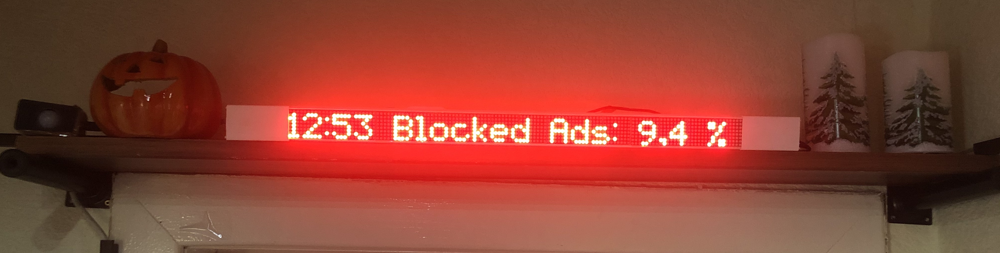

# My Home Assistant Configuration ✨

**Current Version: 0.117.6**

I'm Fabian, a computer science student from Germany. I live in a shared apartment with my partner and a friend of ours. I'm using Home Assistant for about four years right now and Home Automation has become one of my biggest hobbies. During my journey I learned a lot about keeping the network tidy, getting an own point of view of logical shortcuts between devices and a good effort-benefit- and price-performance- assessment.

Because I'm a student and home automation is a slightly expensive hobby. I started my journey in 2016 with almost only DIY sensors and actors, which are mainly driven by a [ESP32/8266](https://www.amazon.de/AZDelivery-ESP32-NodeMCU-gratis-eBook/dp/B07Z83MF5W/ref=asc_df_B07Z83MF5W/?tag=googshopde-21&linkCode=df0&hvadid=427788576373&hvpos=&hvnetw=g&hvrand=8639050305478239369&hvpone=&hvptwo=&hvqmt=&hvdev=c&hvdvcmdl=&hvlocint=&hvlocphy=1003859&hvtargid=pla-898234157885&psc=1&th=1&psc=1&tag=&ref=&adgrpid=99889209552&hvpone=&hvptwo=&hvadid=427788576373&hvpos=&hvnetw=g&hvrand=8639050305478239369&hvqmt=&hvdev=c&hvdvcmdl=&hvlocint=&hvlocphy=1003859&hvtargid=pla-898234157885). Until now, much has changed. More WiFi-devices imply more complexity. More WiFi-devices need a stronger WiFi-Router or some devices need to switch to a alternative network technology. After a while, I switched almost every sensor to a Zigbee device. And so on...

This is my current, active configuration for everyday use. Feel free to inspire yourself and give feedback on my setup. I look forward to discussing with you :)

**TL;DR: I received many inspirations and help from all those smart home developers and enthusiasts and I want to give something back. So here is my Home Assistant Configuration.** 

### 💭 Philosophy ###

In this chapter I want to give you a short briefing about what my smart home should do and where I set my preferences.

1. The Home should work for you. It should look forward, know what you want to do and help you with that action without any further ado.

2. I love building, solder and flashing devices on my own. But during the last years I learned how true the saying “time is money” is. For a wide range of devices DIY is not as reliable and require much more maintanance then official devices. That's why I have two reasons why I build something on my own.

   - It is much significantly cheaper than official hardware
   - It offers many more functionalities than official hardware

   *To be fair: the reliability of devices increases significantly if I use community driven projects like [ESPHome](#ESPHome) or [WLED](#WLED).*

3. The more the Smart Home grows, the more maintenance it needs. Thats why I try to minimize the range of different devices or networks. 

4. The wish to avoid cloud services. I know if you're afraid of your data being abused, don't collect them on your own. But at least I want to pay attention to the sharing of those data.

## 🖥 Hardware ##

My Home Assistant instance is running in a [Docker environment](https://docs.docker.com/get-docker/) on an [Intel® NUC-Kit NUC8i3BEH](https://www.amazon.de/Intel-NUC8i3BEH-Mainboard-Generation-Processors/dp/B07JB2M5JS) with an Intel® Core™ i3-8109U and 16GB DDR4 RAM. All Smart Home related service are running in their own [Docker](https://www.docker.com/get-started) container. 

### ⛓ Network ###

As too many Wi-Fi devices are bad for the stability of the network and always need a power source, I needed to add another communication technology to my network. Because [Zigbee](https://en.wikipedia.org/wiki/Zigbee) devices are overall cheaper than [Z-Wave](https://en.wikipedia.org/wiki/Z-Wave), my decision was made quickly.

#### 🐝 Zigbee #### 

All my battery equipped devices use Zigbee for communication. With the help of [Zigbee2MQTT](https://www.zigbee2mqtt.io) all received information is converted into MQTT messages. For a long time I used the [CC2531](https://www.amazon.de/CC2531-USB-Stick-zigbee2mqtt-ioBroker-Firmware/dp/B07T3GM28F) as Coordinator. All related firmware files can be found [here](https://github.com/Koenkk/Z-Stack-firmware). But because of his weak transmission strength and the low amount of direct children at the same time, I recently decided to move on to the [CC26X2R1](https://www.mouser.de/ProductDetail/Texas-Instruments/LAUNCHXL-CC26X2R1?qs=pfd5qewlna7NQQI%252B7L2KoA%3D%3D).

So far I'm very happy with it. Today I'm using 19 Zigbee sensors, which are noted down below:

| Model                                                        | Image                                                        | Quantity | Notes                                                        |
| ------------------------------------------------------------ | ------------------------------------------------------------ | -------- | ------------------------------------------------------------ |
| Aqara human body movement and illuminance sensor ([RTCGQ11LM](https://www.amazon.de/Aqara-RTCGQ11LM-Motion-Sensor-Bewegungsmelder/dp/B07D1CRRVF)) |  | 2        | Used to detect indoor motion on the stairway and the vestibule. |
| Aqara door & window contact sensor ([MCCGQ11LM](https://www.amazon.de/Aqara-MCCGQ11LM-Window-Sensor-Fensterssensor/dp/B07D37VDM3/ref=sr_1_1?__mk_de_DE=ÅMÅŽÕÑ&dchild=1&keywords=MCCGQ11LM&qid=1605394484&s=diy&sr=1-1)) |  | 6        | Used to detect entering the apartment and tracking the opened windows. |
| MiJia temperature & humidity sensor ([WSDCGQ01LM](https://www.amazon.de/Temperature-Sensor，Eamplest-Temperatur-Feuchtigkeits-Feuchtigkeitserkennung/dp/B086MZQD5C/ref=sr_1_1?__mk_de_DE=ÅMÅŽÕÑ&dchild=1&keywords=WSDCGQ01LM&qid=1605394622&s=diy&sr=1-1)) |  | 3        | Used to track the temperature and humidity of the apartment. |
| Aqara double key wireless wall switch ([WXKG02LM](https://de.aliexpress.com/item/32877238808.html?spm=a2g0o.productlist.0.0.2dc2610ao1Eubk&algo_pvid=5b3e3fd7-8bba-4599-a858-d2bba7fc7b57&algo_expid=5b3e3fd7-8bba-4599-a858-d2bba7fc7b57-2&btsid=0b0a182b16053946613325014e01f2&ws_ab_test=searchweb0_0,searchweb201602_,searchweb201603_)) |  | 3        | The perfect control center for every room. Can detect nine different “pressing”-events. |
| SYMFONISK sound controller ([E1744](https://www.amazon.de/IKEA-Symfonisk-Sound-Fernbedienung-schwarz-104-338-47/dp/B082W1GV75/ref=sr_1_1?__mk_de_DE=ÅMÅŽÕÑ&crid=1R02CA212PKGU&dchild=1&keywords=ikea+symfonisk&qid=1605394706&sprefix=ikea+sym%2Caps%2C174&sr=8-1)) |  | 1        | Currently not in use. Originally used for dimming the workspac lights. |
| Aqara wireless switch ([WXKG11LM](https://www.amazon.de/Aqara-Wireless-Switch-Mini-Lichtschalter/dp/B07D19YXND/ref=sr_1_1?__mk_de_DE=ÅMÅŽÕÑ&dchild=1&keywords=WXKG11LM&qid=1605394752&sr=8-1)) |  | 3        | Simple switch with two action. But his pressure point is not perfect in my opinion. |

Overall I'm very happy with my Zigbee setup. For the future I possibly will replace the “Aqara wireless switch” with a different model. I also should place an [CC2531](https://www.amazon.de/CC2531-USB-Stick-zigbee2mqtt-ioBroker-Firmware/dp/B07T3GM28F/ref=sr_1_9?__mk_de_DE=ÅMÅŽÕÑ&dchild=1&keywords=CC2531&qid=1605394793&sr=8-9) with the router software for a more stable network structure.

#### ☁️ Wi-Fi ####

Today a Wi-Fi-network is inevitable. When one router is not able to reach every spot in the apartment, you need multiple routers to achieve a stable connection. Ealier I configured some old routers to a “Mesh”-like network with multiple [DD-WRT](https://dd-wrt.com) custom flashed routers. But overall it was a real pain to maintain and administrate. First of all becuase I got routers from different brands and each one performs and works a little differently. Second is the configuration is not trivial for a "please just work"-setup. At the end of 2018 I decided to invest into two [“Google Wi-Fi”](https://www.amazon.de/Google-Wifi-Router-Duo-Pack/dp/B073D5P4L7/ref=sr_1_3?__mk_de_DE=ÅMÅŽÕÑ&dchild=1&keywords=google+wifi&qid=1605394841&sr=8-3) Routers. 

These are performing inconspicuous. Everything is stable, but from a networking perspective some more settings with the app are desirable. 

But nonetheless these pucks are able to handle my roundabout 45 devices with no problems. In the following sections I will show you the different devices that are used.

### 💡 Lighting ###

I love colorful LEDs. They help to give every room some dynamic and variety. That's why I'm mainly using color-ranged bulbs and strips instead of white-ranged ones.

For bulbs and ceiling lamps um using [Yeelight](https://www.yeelight.com) Lamps. They are relatively cheap, have a LAN-only-functionality and a stable Home Assistant integration.

| Model                                                        | Image                                                        | Quantity | Notes                                                        |
| ------------------------------------------------------------ | ------------------------------------------------------------ | :------: | ------------------------------------------------------------ |
| Xiaomi Yeelight Bulb V1 ([YLDP02YL](https://www.amazon.de/YEELIGHT-Smart-LED-Glühbirne-Lumen/dp/B073QPD1KX/ref=sr_1_2?__mk_de_DE=ÅMÅŽÕÑ&dchild=1&keywords=YLDP02YL&qid=1605394900&sr=8-2)) |  |    2     | Used as bedside lamps. They are less bright than the V2 and my oldest smart bulbs. |
| Xiaomi Yeelight Bulb V2 (YLDP06YL)                           |  |    1     | One of them is located in our Storage Room.                  |
| Xiaomi Yeelight Bulb 1S ([YLDP13YL](https://www.amazon.de/Glühbirne-Millionen-Weißlicht-Kompatibel-Assistant/dp/B0832XR68B/ref=sr_1_1?__mk_de_DE=ÅMÅŽÕÑ&dchild=1&keywords=YLDP13YL&qid=1605395096&sr=8-1)) |  |    1     | Used on the outside by the entrance. I'm curious if she does survive the cold days... |
| [Yeelight Meteorite](https://www.amazon.de/Yeelight-2700K-6000K-Farbtemperatur-LED-Leuchter-LED-Kronleuchter/dp/B07MY2MTZY/ref=sr_1_1_sspa?__mk_de_DE=ÅMÅŽÕÑ&dchild=1&keywords=yeelight+Meteorite&qid=1605395144&sr=8-1-spons&psc=1&spLa=ZW5jcnlwdGVkUXVhbGlmaWVyPUEzS0paWkJJMVZIVkRRJmVuY3J5cHRlZElkPUEwOTA2NTExUUQ5RkhCQlkzS0c2JmVuY3J5cHRlZEFkSWQ9QTA3NDAyNzk5NTlXTE1FTVo4R0Qmd2lkZ2V0TmFtZT1zcF9hdGYmYWN0aW9uPWNsaWNrUmVkaXJlY3QmZG9Ob3RMb2dDbGljaz10cnVl) |  |    1     | Used in the Workspace room for dinner and ambient lighting. Contains colored light on top and white light on the bottom (adjustable temperature). |
| Xiaomi Ceiling Lamp                                          |  |    1     | Used in our kitchen. Very bright but not that cheap.         |

The lighting strips offered by [Yeelight](https://www.yeelight.com) are very expensive and not worth the money when you can do it yourself :)

Im using four DIY LED Strips with the Software [WLED](https://github.com/Aircoookie/WLED). These are executed on an [ESP-01](https://de.aliexpress.com/item/4000505567851.html?spm=a2g0o.productlist.0.0.40194a59h8sLr7&algo_pvid=36b19a66-effe-4b3f-843c-86309eabe285&algo_expid=36b19a66-effe-4b3f-843c-86309eabe285-3&btsid=0b0a187b16053906987342338e15b5&ws_ab_test=searchweb0_0,searchweb201602_,searchweb201603_) with [RGB-Adapter](https://de.aliexpress.com/item/4000505567851.html?spm=a2g0o.productlist.0.0.40194a59h8sLr7&algo_pvid=36b19a66-effe-4b3f-843c-86309eabe285&algo_expid=36b19a66-effe-4b3f-843c-86309eabe285-3&btsid=0b0a187b16053906987342338e15b5&ws_ab_test=searchweb0_0,searchweb201602_,searchweb201603_). As [power supply](https://de.aliexpress.com/item/4000741932348.html?spm=a2g0o.productlist.0.0.1fa24d62bzqAcz&algo_pvid=c91f7f6f-7261-4fe9-9880-d96bf9194acc&algo_expid=c91f7f6f-7261-4fe9-9880-d96bf9194acc-0&btsid=2100bde316053910324372519ef81f&ws_ab_test=searchweb0_0,searchweb201602_,searchweb201603_) im using basic 5V ones and for the lighting [WS2812B LED Strips](https://de.aliexpress.com/item/32682015405.html?spm=a2g0o.productlist.0.0.322a4c9e8dQBrC&algo_pvid=d1e877f2-bc62-4237-9084-3cfd792d8485&algo_expid=d1e877f2-bc62-4237-9084-3cfd792d8485-7&btsid=2100bdd516053912230116342eaf4d&ws_ab_test=searchweb0_0,searchweb201602_,searchweb201603_). For an 3M Led Strip (60 LEDs per Meter) I'm paying around 30 Euro. On top we have all features of the [WLED](https://github.com/Aircoookie/WLED) firmware.

### 🛋 Phillips Hue ###

As I noted in my previous chapters, I want to keep the amount of different networks as small as possible. But an exception confirms the rule. Phillips Bulbs are also based on the Zigbee connection technology. As a Wi-Fi to Zigbee converter, they are using the Hue Bridge. But why do I use them, when I simply can add all Zigbee devices to my Zigbee2MQTT interface?

- Use "[Ambilight+Hue](#TV)". Alternative solution like [diyHue](https://github.com/diyhue/diyHue) or [ambilight-yeelight](https://github.com/jomwells/ambilight-yeelight) does not work in my case.
- Use an old Phillips LivingColors Bloom again, as they are not able to connect to my Zigbee2MQTT
- Improve the performance of my "Hue motion outdoor sensor", which sometimes lose connection, which leads to a disassembly followed by a repair.

Long story short: I wanted to minimize afford. Here are my current Phillips Hue devices:

| Model                                                        | Image                                                        | Quantity | Notes                                                        |
| ------------------------------------------------------------ | ------------------------------------------------------------ | -------- | ------------------------------------------------------------ |
| Phillips E27 white & color ([LCA001](https://www.amazon.de/Hue-Doppelpack-2x806lm-Bluetooth-Energieklasse/dp/B07SS38CVG/ref=pd_lpo_201_t_0/260-7052561-1317654?_encoding=UTF8&pd_rd_i=B07SS38CVG&pd_rd_r=2becca34-75ef-418a-8e9b-ce527592955a&pd_rd_w=Dg3ZD&pd_rd_wg=PiQ18&pf_rd_p=d5c9797d-0238-4119-b220-af4cc3420918&pf_rd_r=9PFXPN6WR9H27BAK4K01&refRID=9PFXPN6WR9H27BAK4K01&th=1)) |  | 1        | Used in the living room (Ambilight) and the vestibule (Zigbee Router for outdoor sensor). |
| Hue motion outdoor sensor ([9290019758](https://www.amazon.de/Philips-Hue-Bewegungssensor-Aussenbereich-Tageslichtsensor/dp/B07KMP8P1Q/ref=sr_1_2?__mk_de_DE=ÅMÅŽÕÑ&dchild=1&keywords=hue+outdoor&qid=1605394774&sr=8-2)) |  | 1        | Used for capturing the outdoor temperature and entrance lighting. |
| Phillips LivingColors Bloom 3. Gen. ([LLC005](https://www.amazon.de/Philips-LivingColors-Tischleuchte-weiß-7099760PH/dp/B009567RE2/ref=sr_1_1?__mk_de_DE=ÅMÅŽÕÑ&dchild=1&keywords=phillips+bloom&qid=1606560541&sr=8-1)) |  | 1        | Used to light up the whiteboard in the storage room.         |

Random problems and their solution

  <ul>
      

If you turn on one Phillips Bulb via Home Assistant, other Phillips Bulbs will turn on, on their own, too

      

        <ul>
          <li>Be sure that every bulb that should operate on its own, got its own room in the Hue App.</li>
          <li>Remove/Verify all used Apps by the Hue App, to do this you need an third-party App like <a href="https://www.hueessentials.com">Hue-Essentials</a>.</li>
         </ul>

  </ul>

### 🏃🏻‍♂️ Presence Detection ###

Detecting residents in a specific area is not easy to establish, but it's paying off. You can turn the lights off or disable the heater when nobody is at home. You can automatically start the alarm-management or trigger the vacuum robot... Personally I'm dividing the variants of presence detection into different levels. There are **two level of region precision** (room based vs. home based) and **two level of human/identity precision** (there is a living thing vs. there is resident with a known name).

- For the room based region precision I'm using simple motion sensors, which only detects that *there is a living thing* 
- For the home based region precision um using “[monitor](https://github.com/andrewjfreyer/monitor)”, a simple script which runs on two [Raspberry Pi Zeros](https://www.raspberrypi.org/products/raspberry-pi-zero/?resellerType=home). They are able to detect “known” BLE ([Bluetooth Low Energy](https://en.wikipedia.org/wiki/Bluetooth_Low_Energy)) devices and as long as every resident has a smartphone which does he takes with him when he leaves the house, you can easily detect if a resident is at home. As long as he does not forget his phone 🤷🏼‍♂️ I also use WiFi for presence detection with a simple network scan, for a specific device.

#### Problems with Presence Detection ####

|                | **There is a living thing**                                  | **There is resident with the name**                          |
| -------------- | ------------------------------------------------------------ | ------------------------------------------------------------ |
| **room based** | **Easy** Motion Sensors, Switches, Buttons (Basically every sensor that needs an interaction). | **Hard** Requires the resident to ALWAYS take their personal device (e. g. smart phone) with it them. In my opinion only realizable with Smart Watches. |
| **home based** | **Easy** Motion Sensors, Switches, Buttons (Basically every sensor that needs an interaction). | **Medium** Requires BLE monitoring and well-defined scanning algorithms. Not easy to establish but very reliable. |

Important corresponding automations

  <ul>
      <li> <a href="/config/automations/presence/announcements.yaml" title="/config/automations/presence/announcements.yaml">Announcements to arriving residents</a></li>
      <li> <a href="/config/automations/presence/arrive_depart.yaml" title="/config/automations/presence/arrive_depart.yaml">Trigger arrive/depart scans</a></li>
  		<li> <a href="/config/automations/presence/bt_first_floor.yaml" title="/config/automations/presence/bt_first_floor.yaml">Trigger "monitor" restarts on malfunction </a></li>  
      <li> <a href="/config/automations/alarm_management/alarm.yaml" title="/config/automations/alarm_management/alarm.yaml">Trigger initial scan, if no one is home </a></li>  
  </ul>

Random problems and their solution

  <ul>
      

Your iPhones Wifi is not detected by nmap(network scanner) 

      

        <ul>
          <li>In iOS 14 Apple introduced "Private WiFi Adresses". To avoid tracking, they publishing fake MAC-Adresses, which are changing from time to time. You can turn this feature off network wise in settings. </li>
         </ul>

  </ul>

### 🧹 Vacuum Robot ###

The newest member in our small Smart Home is a used [Roborock S50](https://www.amazon.de/RoboRock-Staubsauger-Sweep-Mop-Steuerung-Internationale/dp/B07FD8GC1C) (or S51/S55 - different color). 

Why especially this device? Because it uses a smart Laser-based navigation(no random algorithms), is rootable and is supported by Valetudo. It is important to me to interrupt the cloud connection to Xiaomi. His little brother the [Xiaomi Mi Robot](https://www.amazon.de/Xiaomi-Saugroboter-Staubsauger-Kehrmaschine-Steuerung/dp/B01LYV1EMA/ref=pd_lpo_79_t_0/260-7052561-1317654?_encoding=UTF8&pd_rd_i=B01LYV1EMA&pd_rd_r=68c901e4-bbb9-4551-96b6-79d031291d4d&pd_rd_w=Fnimb&pd_rd_wg=YIxMw&pf_rd_p=d5c9797d-0238-4119-b220-af4cc3420918&pf_rd_r=EA2CRW8TBWB03PGYNE88&psc=1&refRID=EA2CRW8TBWB03PGYNE88) has a fewer features. The Roborock S50 supports virtual No-Go Borders and saves the created map over multiple cleaning runs. For an advanced comparison click [here](https://valetudo.cloud/pages/knowledge_base/supported-roborock-devices.html#gen-2).

Using in automations

  <ul>
      <li> <a href="/config/automations/vacuum/vacuum_bin.yaml">Command vacuum to go to the bin</a></li>
      <li> <a href="/config/automations/vacuum/vacuum_auto_clean.yaml">Automatic cleaning</a></li>
      <li> <a href="/config/automations/vacuum/vacuum_error_detection.yaml">Vacuum error detection</a></li>
      <li> <a href="/config/automations/vacuum/vacuum_notification.yaml">Notification when cleaning has finished</a></li>
    </ul>

*Note: If you want to buy this device, be sure to get one with old production date (before 2019-11) as the factory firmware (to which the robot can be reset) does allow the installation of a custom ROM.*

### 📱 Wall mounted tablet ###

If you want an dynamic control panel for your Home Assistant, beside your phone, an wall-mounted tablet is a easy alternative. For this purpose I've bought a Amazon Fire HD8" 2018 ("karnak"). All Fire Tablets devices are relatively cheap but are having a big downside: Fire OS. This stripped down version of Android is just a pain. After a bit of investigation I found a custom ROM that fitted my device. I've installed [Lineage OS](https://www.lineageos.org) on it successfully and it just works.

To integrate my tablet I'm using [Fully Kiosk Browser](https://www.fully-kiosk.com) with the [browser_mod](https://github.com/thomasloven/hass-browser_mod). This allows me to get access to literally all of it's sensors including brightness control, camera and microphones. 

Using in automations

  <ul>
      <li> <a href="/config/automations/tablet/fire_ground_floor.yaml">Turn on Fire Tablet in/after the night</a></li>
      <li> <a href="/config/automations/presence/someone_home.yaml">Turn on Fire Tablet when someone is home</a></li>
    </ul>

*Hint: The tablet lose it's connection to Home Assistant if I lock the device. Thats why I'm just setting the brightness to the lowest setting.*

### 📺 Television ###

As TV we are using a **Phillips 55PUS7503**. For the main facts, it features a 55 inch display and was build in 2018. Why Phillips? For a need little thing called Ambilight. Basically the TV has build-in LEDs around the edge, facing the wall behind it. The purpose of them is to emulate an enlargement of the picture by displaying the same colors as the display show on the same position. From a Smart-Home perspective this TV features an API with allows remote control over the network.

To integrate [this](https://github.com/nstrelow/ha_philips_android_tv) component.

Today Phillips Hue is a big player in the lighting Smart-Home industry. To upgrade the cross-over usability of their device, they introduced a feature called "Ambilight+Hue". As you might expect: With this feature you are able to connect your Hue Bulbs to the LEDs from Ambilight. This way you can extend the Ambilight effect even more...

*Problem: As I've not connected an ethernet cable on the installation I'm only able to connect to the TV via Wi-Fi (I'm not able to remove the TV from the wall mount again). The TV also uses a feature called WoWLAN, which works just like Wake-on-LAN, but Wi-Fi gets disabled on standby periodically. This leads to non-deterministic switch-on behavior. As a walkaround I use the guide posted [here](https://github.com/nstrelow/ha_philips_android_tv). With the help of the APP "Wakelock Revamped", you are able to disable the automatic Wi-Fi disconnect on standby.*

### ⚡️ IR-Sender ###

As not every command is supported by the media_player interface, we need a alternative to send commands to the TV. For this propose I'm using the [RM4C mini](https://www.amazon.de/Universal-IR-Fernbedienung-Stimmenkontrolle-Koordinierung-Intelligente-Automatisierungsmodule-Schwarz/dp/B08215598C/ref=sr_1_3?__mk_de_DE=ÅMÅŽÕÑ&dchild=1&keywords=RM4C+mini&qid=1605704505&sr=8-3). To control this handy device I use the [Broadlink Integration](https://www.home-assistant.io/integrations/broadlink/). This does also support the learing of new IR-Commands.

Using in automations

  <ul>
      <li> <a href="/config/scripts/living_room_media.yaml">Turn on/off and adjust living_room devices</a></li>
    </ul>

### ESP32/ESP8266 ###

This ESP Family is a famous name in the DIY Smart Home and IoT world. The [ESP32](https://www.amazon.de/AZDelivery-ESP32-NodeMCU-gratis-eBook/dp/B07Z83MF5W/ref=asc_df_B07Z83MF5W/?tag=googshopde-21&linkCode=df0&hvadid=427788576373&hvpos=&hvnetw=g&hvrand=8639050305478239369&hvpone=&hvptwo=&hvqmt=&hvdev=c&hvdvcmdl=&hvlocint=&hvlocphy=1003859&hvtargid=pla-898234157885&psc=1&th=1&psc=1&tag=&ref=&adgrpid=99889209552&hvpone=&hvptwo=&hvadid=427788576373&hvpos=&hvnetw=g&hvrand=8639050305478239369&hvqmt=&hvdev=c&hvdvcmdl=&hvlocint=&hvlocphy=1003859&hvtargid=pla-898234157885) is the successor of the ESP8266. Both have a lot of GPIO Pins, 5V Micro-USB power supply and Bluetooth+Wi-Fi connectivity. They also have a very large community with projects like [ESPHome](https://esphome.io) and the mentioned [WLED](https://github.com/Aircoookie/WLED).

[ESPHome](https://esphome.io) allows to build a firmware based on the connected sensors and devices. All of the following devices are base on [ESPHome](https://esphome.io). Everyone who works with a lot of self programmed ESP Devices should try this service! It saves a lot of time of programming...

#### MAX7219 - Led Matrix ####

I like the idea of sharing the collected information of the apartment with the residents. At the same time there should be the possibility to notify the residents, beside sending them a phone notification. At this point I was searching for an alternative and found the [MAX7219 LED Matrix](https://www.amazon.de/AZDelivery-MAX7219-Matrix-Anzeigemodul-Arduino/dp/B079HVW652/ref=asc_df_B079HVW652/?tag=googshopde-21&linkCode=df0&hvadid=309901650373&hvpos=&hvnetw=g&hvrand=9116350884031864081&hvpone=&hvptwo=&hvqmt=&hvdev=c&hvdvcmdl=&hvlocint=&hvlocphy=1003859&hvtargid=pla-602010100762&psc=1&th=1&psc=1&tag=&ref=&adgrpid=62387684635&hvpone=&hvptwo=&hvadid=309901650373&hvpos=&hvnetw=g&hvrand=9116350884031864081&hvqmt=&hvdev=c&hvdvcmdl=&hvlocint=&hvlocphy=1003859&hvtargid=pla-602010100762).

On the left side you can see the current time and on the right a random information. There is also a mode for blocking information(that need an interaction to disappear) or an notification, that shows one time for about ten seconds. More information can be found [here](#LED_SIGN).

Using in automations

  <ul>
      <li> <a href="/config/scripts/led_sign.yaml" title="/config/scripts/led_sign.yaml">Display information</a></li>
      <li> <a href="/config/automations/presence/announcements.yaml" title="/config/automations/presence/announcements.yaml">Showing announcements</a></li>
    </ul>

#### 🌡 DHT22 - Temperature/Humidity Sensor ####

In the bedroom there is still a [DHT22](https://www.amazon.de/AZDelivery-Temperatursensor-Luftfeuchtigkeitssensor-Platine-Arduino/dp/B078SVZB1X/ref=sr_1_5?__mk_de_DE=ÅMÅŽÕÑ&dchild=1&keywords=DHT22&qid=1605960850&sr=8-5) Sensor in use. It should be replaced with an Aqara sensor in the future to keep consistency. I'm still playing with the thought to add some other sensors to this ESP to get a  overview over the air quality...

#### 🧍🏼‍♂️ HC-SR501 - PIR Sensor ####

[HC-SR501](https://www.amazon.de/AZDelivery-HC-SR501-Bewegungssensor-Bewegungsmelde-Arduino/dp/B07V9GFHFW/ref=sr_1_3?__mk_de_DE=ÅMÅŽÕÑ&dchild=1&keywords=HC-SR501&qid=1605961007&sr=8-3) boards are relatively cheap but I have always bad luck with them. By now there are two of them in use and both are working on 5V (You can also power them with 3.3V). An advantage over the [Zigbee counterpart](https://www.amazon.de/Aqara-RTCGQ11LM-Motion-Sensor-Bewegungsmelder/dp/B07D1CRRVF) is that you can adjust the delay between scans.

#### Debugpanel ####

A little wooden plank with build-in LEDs and adhesive labels beside them. The debugpanel is helping me to observe the state of specific events, even if I'm not looking at my Home Assistant interface. All of these LEDs can be addressed individuelly, and are part of their own automation. For example: A lot of automations are based on the [evening_mode](automations/evening_routine/), so it got its own LED.

Beside the LEDs there are also two switches and a HC-SR501-Sensor. I thought about adding a Display to it, which shows a small Home Assistant Log...

Using in automations

  <ul>
      <li> <a href="/config/automations/debugpanel/clean_kitchen.yaml" title="/config/automations/debugpanel/clean_kitchen.yaml">Command vacuum robot to clean kitchen</a></li>
      <li> <a href="/config/automations/debugpanel/speech_enable.yaml" title="/config/automations/debugpanel/speech_enable.yaml">Dis-/enable speech assistant</a></li>
    	<li> <a href="/config/automations/debugpanel/kitchen_motion.yaml" title="/config/automations/debugpanel/kitchen_motion.yaml">Turn on light after motion</a></li>
    </ul>

#### 🏋🏼‍♂️ HX711 - Weight Sensor ####

Some of you might ask what you can do with a weight sensor in a Smart Home. A whole lot of! I use them placed under my bed to detect the presence there. Because my partner weighs less than me, we can differentiate who and how much people are there. This enables a lot of handy automations.

Using in automations

  <ul>
      <li> <a href="/config/automations/rooms/bedroom/weight.yaml" title="/config/automations/rooms/bedroom/weight.yaml">Leaving and joining bed</a></li>
      <li> <a href="/config/automations/rooms/bedroom/switch_single.yaml" title="/config/automations/rooms/bedroom/switch_single.yaml">Turn on light based on bed presence</a></li>
    </ul>

*The idea for this use case of the HX711 is from [here](https://selfhostedhome.com/diy-bed-presence-detection-home-assistant/)*

## Software Components ##

I'm using different Software Components and custom Home Assistant integrations to round off my setup. Two big reliefs ist [Home Assistant Supervised](https://github.com/home-assistant/supervised-installer) and [HACS](https://github.com/hacs/integration). Home Assistant Supervised is a Docker based version of Home Assistant, which supports the installation of external Integrations (Add-Ons). These are executed in their own Docker container (basically their own execution environment).

You can install different custom integration into your Home Assistant config folder. Normally these are managed manually by the user, but [HACS](https://github.com/hacs/integration) gives the opportunity to list, install/update and maintain all of your integrations. Beside them, [HACS](https://github.com/hacs/integration) allows you to install custom [Themes](https://hacs.xyz/docs/categories/themes) and [Lovelace-Cards](https://hacs.xyz/docs/categories/plugins).

### HACS - Current used Integrations ###

- [Circadian Lighting](https://github.com/claytonjn/hass-circadian_lighting) - Used for synching lights color (and/or brightness) with the current daylight. 🌇
- [browser_mod](https://github.com/thomasloven/hass-browser_mod) - Turn the [Fully Kiosk Browser](https://www.fully-kiosk.com/) in a controllable entity. ☁️

### HACS - Currently used Lovelace Cards ###

- [mini-graph-card](https://github.com/kalkih/mini-graph-card) - Beautiful graphs for Lovelace. 📊
- [simple-thermostat](https://github.com/nervetattoo/simple-thermostat) - A pretty nice visualsation for climate entities. 🌡
- [vacuum-card](https://github.com/denysdovhan/vacuum-card) - Nice card for the visualsation of vacuum entities. 🧹
- [lovelace-valetudo-map-card](https://github.com/TheLastProject/lovelace-valetudo-map-card) - To display the Map from [Valetudo](https://github.com/Hypfer/Valetudo). You will also need [this]() Add-On for image conversion. 🗺
- [atomic-calendar-revive](https://github.com/marksie1988/atomic-calendar-revive) - Calender-Card with plenty of customisation. 📅

### HA Supervised Add-Ons ###

- [Adguard](https://github.com/hassio-addons/addon-adguard-home) - Ad-Blocking for the entire network ([PiHole](https://www.home-assistant.io/integrations/pi_hole/) replacement). 🛡
- [ESPHome](https://esphome.io/guides/getting_started_hassio.html) - Manage all my ESPHome enabled IoT devices. 🏠
- [Mosquitto](https://github.com/home-assistant/hassio-addons/tree/master/mosquitto) - MQTT Server for my network. ☀️
- [ps4Waker](https://github.com/vkorn/hassio-addons/tree/master/ps4waker) - Helps to automatically start-up my PS4.
- [RPC-Shutdown](https://github.com/home-assistant/hassio-addons/blob/master/rpc_shutdown/README.md) - Shutdown Windows Machines.
- [valetudo-mapper](https://github.com/Poeschl/Hassio-Addons/tree/master/valetudo-mapper) - Converts Valetudo Map to a PNG and adds camera entity for viewing.
- [VSCode](https://github.com/hassio-addons/addon-vscode) - Visual Studio Code through browser. Used for whole automation implementation.
- [Zigbee2MQTT](https://github.com/danielwelch/hassio-zigbee2mqtt) - Bridge to pipe Zigbee Device Information to MQTT. 🐝
- [Philips Ambilight+Hue](https://github.com/jomwells/ambihue) - Dis-/Enable Ambilight+Hue with a Switch.
- [Home Assistant Philips TV](https://github.com/nstrelow/ha_philips_android_tv) - Integrate Phillips Android TVs as media_player.

### Miscellaneous ###

- [monitor](https://github.com/andrewjfreyer/monitor) - Using to track BLE devices. Used for presence detection. 🔷🦷

## More complex automations ##

In this section I want to describe some of my more complex automation-systems. Maybe someone is interested in this and/or has some ideas to improve the systems.

### The LED Sign - Notifications and random facts for everyone 🌈 ##

You all know the idea. A continuous information source to show some of the collected information and notify the residents in special cases.

To distinguish between the states of this I created an [input_select](https://www.home-assistant.io/integrations/input_select/) to represent those.

- **Default** - Every two minutes an event is fired to update the current text with a random text from [templates/led/status.yaml](templates/led/status.yaml).
- **Notification** - Notifications are a bit senseless regarding their reliability, because you need to see them. Example: If someone arrives at home a welcome message is printed there. These kinds of notifications disappear after 10 seconds and are restoring the previous text to the sign. If the current State is "Hard", no notification will be shown.
- **Hard** - Example: If the vacuum robot's bin should get cleared a "Hard"-Notification is printed. This kind of notification will not get overwritten by anything. Only after an acceptance/specific action of the user, the message will get removed. 
- **Disabled** - If no one is at home the state switches to "Disabled". This state behaves similar to "Hard", because it can only be interrupted by a specific action(arrival of a resident).

Here is a short illustration:

### Bedroom and corresponding lights 🛏 ###

Another quiet complex structure has my bedroom-weight-light automation system. If someone asks me what the most abstract sensor in my setup, I usually tell them about the weight sensors under my bed. At the beginning it sounds a bit unnecessary, but the potential is huge. Here is what I'm doing: At first I need to mention that my partner and me are having their fixed side of the bed for sleeping. At this point it is easy to say, that we both got our own bedside lamp. Another point that is playing in my hands is that we've got a moderate weight difference between us. 

Long story short: When someone leaves the bed I can easily tell, who it was. I have placed two buttons in our bedroom, one between us, over the bed and the another at the entrance. The buttons are obviously used to control the lights. But there are some different interactions based one time and if someone is sleeping already.

- Entrance Button (single)
  - **Single:** If no one is in bed: Toggle both lights with full brightness
  - **Single:** If someone is in bed: Toggle the lamp of the resident that is not in bed at low brightness
- Bedside Button (double)
  - **Single Left/Right:** Toggle the corresponding side with medium brightness
  - **Both:** Turn on both lights with full brightness

- Weight Control
  - **Enabled**: When one of us lays in bed for more than 15 minutes.
    - When the resident leaves the bed, the light on his side goes on with very low brightness.
    - When the resident lays down again, the light turns off again.
  - **Disabled:** When the sun rises.

Corresponding automations

  <ul>
      <li> <a href="/config/automations/rooms/bedroom/weight.yaml">Weight based automations</a></li>
    	<li> <a href="/config/automations/rooms/bedroom/switch_single.yaml">Entrance button</a></li>
      <li> <a href="/config/automations/rooms/bedroom/switch_double.yaml">Bedside button</a></li>

## Future Plans 👨🏻‍🔧 ##

- Add Wii "Power" to IR Sensor. Maybe PS4 too...
- Reintegrate my [OpenTherm Gateway](https://www.nodo-shop.nl/nl/opentherm-gateway/188-opentherm-gateway.html). Looking forward to [this](https://github.com/rvdbreemen/OTGW-firmware) to get released.
- Place an [CC2531](https://www.amazon.de/CC2531-USB-Stick-zigbee2mqtt-ioBroker-Firmware/dp/B07T3GM28F/ref=sr_1_9?__mk_de_DE=ÅMÅŽÕÑ&dchild=1&keywords=CC2531&qid=1605394793&sr=8-9) with [this](https://github.com/Koenkk/Z-Stack-firmware/tree/master/router/CC2531) router software to improve my Zigbee network load.
- Adding some christmas lights 🎄

## Support my coffee consumption ☕️ ##

I'm powered by coffee. If you like my work, you can [buy me a coffee](https://www.buymeacoffee.com/durinfab). ❤️